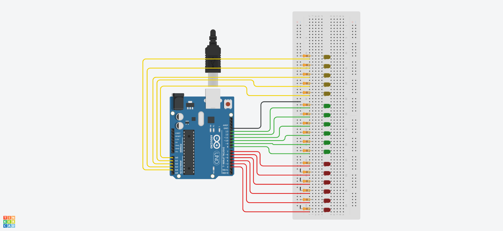

# Arduino Binary Clock

An Arduino UNO that will show the time in binary format based on which LED is turned on

# Components

* 1 Arduino Uno R3
* 6 red LEDs
* 6 green LEDs
* 5 yellow LEDs
* 17 Resistors 330Ω

# Circuit

Red LEDs represents seconds, green LEDs represents minutes and yellow LEDs represents hours.

# Code

The code for Arduino can be found in the `src` directory. It's just a single file written in `C`.

# Simulation

[watch how it works in tinkercad](https://www.tinkercad.com/things/jHJnAZl8Hgy)
